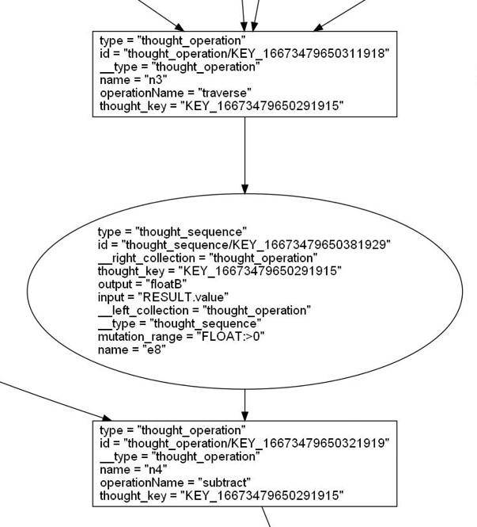
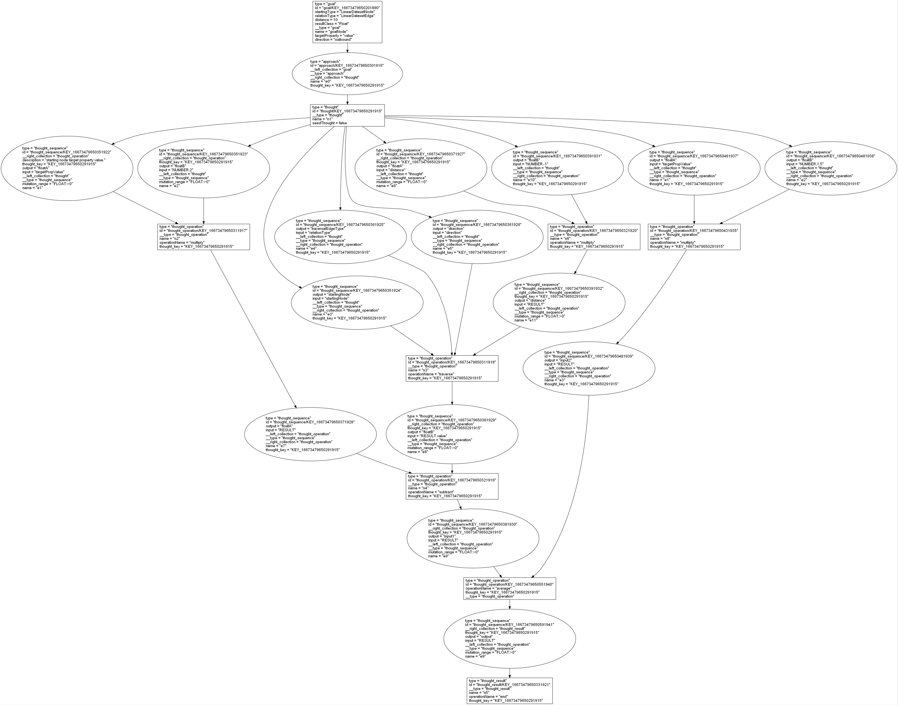
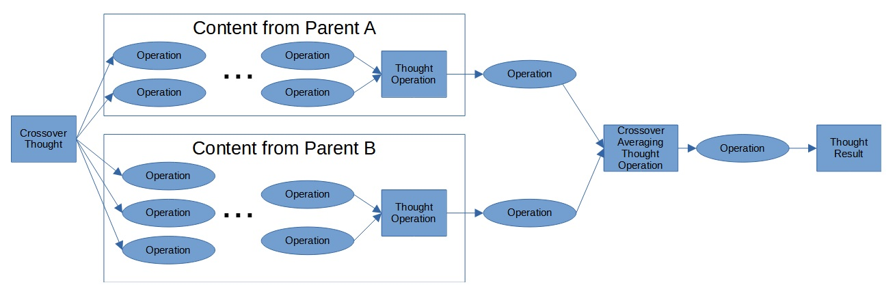
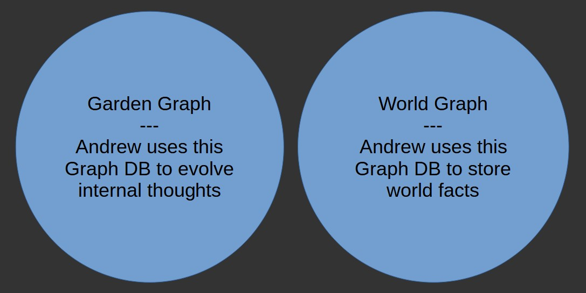
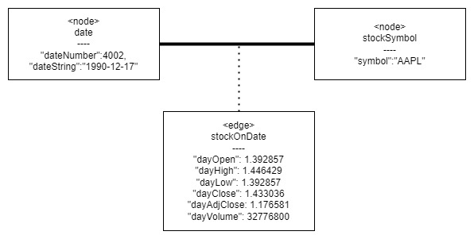
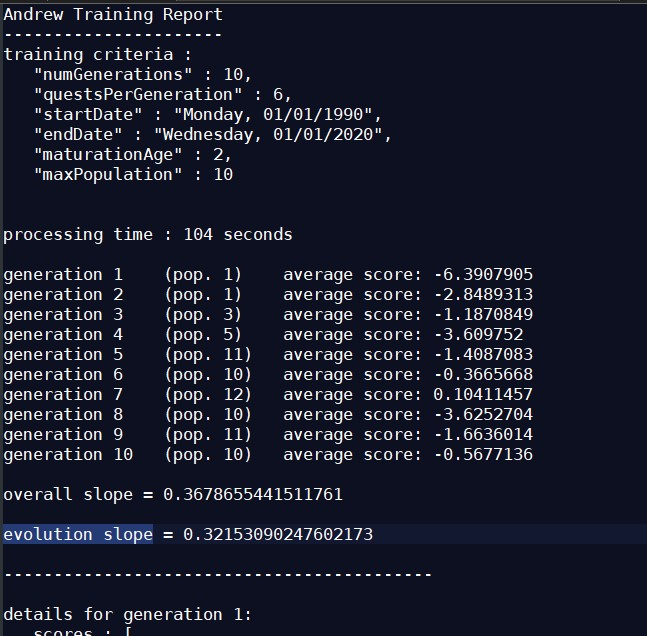

# Andrew v1.0

## Overview

Andrew is like a blend of a genetic algorithm implementation and Scratch programming.

Andrew is a time-series forecasting AI application that uses a genetic algorithm on graphs of code-block-based genes. These graphs are referred to as Thought Graphs.  Thought Graphs are associated with a specific target Goal.  As Andrew runs, the Thoughts are combined and mutated into new thoughts.  Andrew starts with a given set of initial Thoughts, referred to as Seed Thoughts, representing a process for solving a problem.  Seed Thoughts generally model basic ideas, such as linear movement, and correlation.

Andrew was developed out of the desire to make something new and interesting.  Some of the initial ideas for Andrew came from an old version of a lecture from MIT OpenCourseWare 6.034 where little focus was given to Genetic Algorithms and Neural Nets due to a variety of issues.  Later, based on advancements in Neural Nets, those sections were modified to have more focus.  While Neural Nets have now hit the mainstream, Genetic Algorithms seem to have underexplored frontiers.  Andrew looks to investigate some of these less-studied frontiers.

Thoughts are mainly composed of Thought Operations (nodes) and Thought Sequences (edges).  The Thought Sequences are edges that pass data between Thought Operations. The Thought Operations run simple processes based on their defined operation type.  Besides the passing of data between Thought Operations, Thought Sequences also contain properties that support mutation on the passed data.  These mutation-related properties identify the range of mutations supported, and specify the amount of current mutation.  Mutations may be supported for virtually any data type, from simple mutations in Integer values to more complex mutations of a value within a set of valid values; for example, changing the name of an other-side object or relation name used as input to a Thought Operation.

---

**NOTE:** 
Andrew currently only supports non-cyclic Thoughts.

---

<kbd>
<a href="./readme_files/thought_snippet.jpg" target="_blank">

</kbd> 
figure: a snippet of a thought containing two operations connected via a sequence</a> 

The current Thought Operation types supported are minimal.  In a rush to produce an initial release, some of the operations created are overly complex, and will be replaced with combinations of smaller thought operation subgraphs.  For example, the getSymbolDateRel Operation type makes assumptions as to the Node and Edge types on which it operates.  These assumptions should be removed and pushed to Thought Sequence inputs to the Operation, thus allowing more general use and situations where mutations can be leveraged.

Thoughts start with a connection from the target Goal via an Approach Relation to a Thought node.  The Thought node then connects to layers of Thought Sequences and Thought Operations.  At the end of each thought graph, there is a final thought operation that connects via a Thought Sequence to a Thought Result node.  The processing of the Thought Result node completes the processing of a Thought for a given context.

<kbd>
<a href="./readme_files/thought_example.jpg" target="_blank">

</kbd> 
figure: a seed thought for linear rates of change</a>

Andrew may leverage different implementations of Crossover.  Crossover works by cloning the parent Thoughts and then merging the clones.  The first Crossover implementation simply works by having the Crossover Thought Node connect to all the first layer Thought Sequences, and then at the aft end replacing the cloned Thought Result nodes with a single aggregating Thought Operation that is then connected to the Thought Result node.  The Simple Crossover implementation produces a result that is the average of the two parents.

<kbd>
<a href="./readme_files/crossover.jpg" target="_blank">

</kbd> 
figure: an overview of a Simple Crossover</a>

Andrew plans for future Crossover implementations to be more complex.  A leading candidate for the next Crossover implementation is a crossover that merges all ancestors into a single averaging Thought Operation where the input value weights can be mutated, thus allowing individual ancestors to have a variety of weights of impact beyond what is dictated by the number of generations that have passed.  Additional thought complexity may allow variable weights to be determined by variable input;  for example, in the domain of stock market prediction, a high VIX value may feed a higher weight for a given input than a low VIX value.

Andrew's current fitness function is a basic error percentage calculation.  In the future, the fitness functions may also be subject to evolution via genetic algorithms within defined parameters, thus allowing them to compete.  For example, Fitness Functions that measure stock-picking Thoughts every quarter for a year may prove to be more fit at finding profit than a once-a-year Fitness Function even after accounting for transaction fees.  As long as the underlying scoring criterion is correct (in this case, annualized rate of return), changing the parameters of the fitness functions might produce improved overall results.

---

**NOTE:** 
A program may have the ability to somewhat change its goals.

---

Andrew has an overall training process that implements the genetic algorithm.  This process is currently hard coded.  Future training processes may be genetic algorithms, where their seed implementations include mutation points that adjust the amount of mutation for each Thought, both the number of mutations and the magnitude of each mutation, in inverse proportion to the general fitness of the thought.

---

**NOTE:** 
Over time, Andrew will evolve to replace most of its hardcoded control functions to being genetic algorithms, basically turning Andrew into layers of genetic algorithms producing genetic algorithms.

---

Andrew operates using two separate graph repositories.  The internal thought-related elements exist in the Garden Graph; This graph changes as Andrew runs.  The external world data on which forecasts are based is contained in a static graph called either the World Graph or the Data Graph.

<kbd>
<a href="./readme_files/two_db.jpg" target="_blank">

</kbd> 
figure: the databases used by Andrew</a>

The initial World Graph for Andrew is populated with stock price data.  However, the World Graph can be easily extended to contain other types of data.  The basic structure for the World Graph is to show the relationship of elements on dates.  An example of an extension of the World Graph would be to add tweets; there would be a tweet edge containing the content of the tweet, and it would connect a date to a sender.  Possible uses for this data would be to test if tweets by people such as Elon Musk or Donald Trump have an impact on stock prices, and which ones.

<kbd>
<a href="./readme_files/world_graph_snippet.jpg" target="_blank">

</kbd> 
figure: a snippet of data within the World Graph</a>

Andrew generates a report for the results of training.  This report describes the inputs used in training and the results.  The report shows the resulting Overall Slope and the Evolution Slope for the training process.  Both slopes are computed using linear regression.  The Overall Slope shows the slope of the average scores of each training generation over the generations.  The Evolution Slope shows improvement of non-seed thoughts over seed thoughts over the generations; put another way, the Evolution Slope tells you if the descendent thoughts are getting smarter than the seed thoughts.

<kbd>
<a href="./readme_files/sample_report.jpg" target="_blank">

</kbd> 
figure: sample report snippet</a>

Besides producing outputs for consumption for downstream Thought Operations, Thought Operations may also produce side effects.  For example, having a Thought Operation that sends out e-mail is considered a valid operation.  Future work will be required to accurately model the impacts of side effects; currently, the external nature of side-effect impacts on results is not modeled in the training logic.

---

**Note:** 
Given that side effects are allowed, a research topic on the difference between predicting and causing results should be considered.

---

Andrew is designed to support horizontal scaling for both its graph data sources and its processing power. The current graph databases used by Andrew are built on top of Arango DB, thus allowing the database to horizontally scale on commodity hardware.  Andrew has plans to support the horizontal scalability of training logic by incorporating parallel message processing for individual evaluations within the training routine, most likely by using RabbitMQ.

## Running the Example Code

General information on how to compile and run the example can be found in <a href="./notes/dev_notes.md" target="_blank">the dev_notes.</a>

