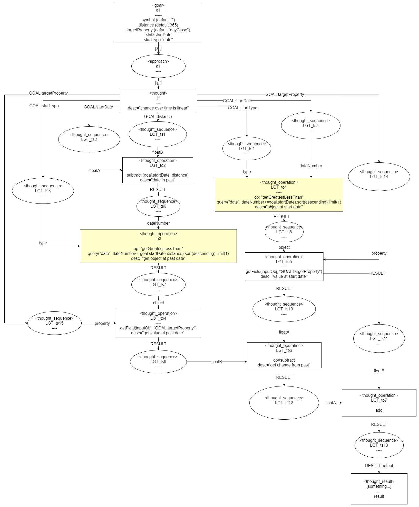

# Overview

The thought assumes that stocks move in a linear direction over time, and that the difference in price in the future is the same as in the past.

[ future_price(+days) = current_price + ( current_price - past_price(-days) ) ]

# Goal Input Attributes

* symbol (default:"")
* distance (default:365)
* targetProperty (default:"dayClose")

# thought outputs

* RESULT.output : the closing price at the given date in the future.

# supported mutations

* ...

# Thought Diagram

[Note: Source of graphics is <a href="https://app.diagrams.net/?mode=google&gfw=1#G1yHheWAigkm8GaCBHv3vERHQR-btmRYn_">here</a>.]